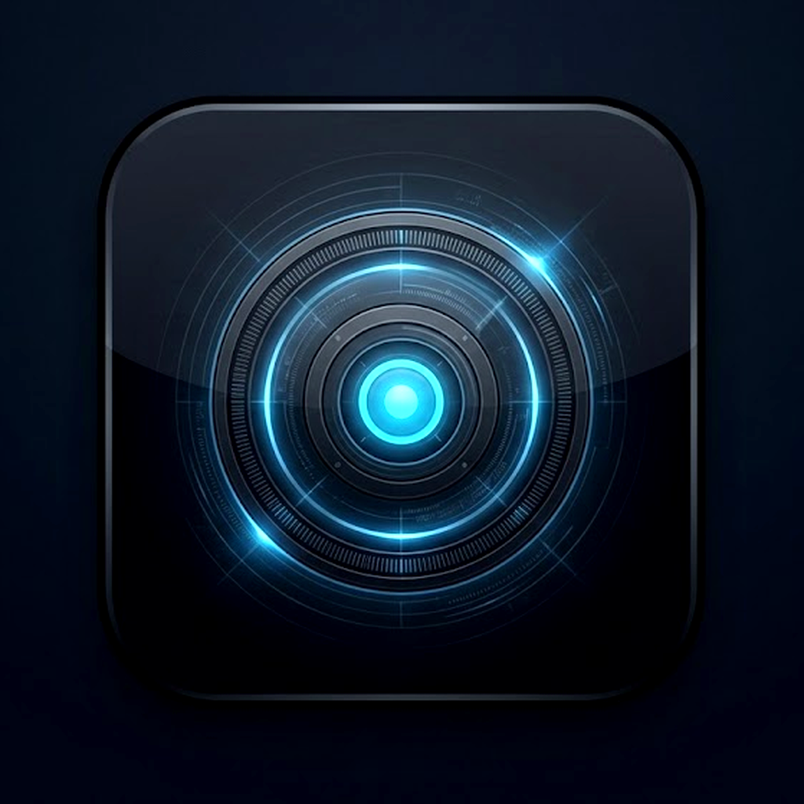
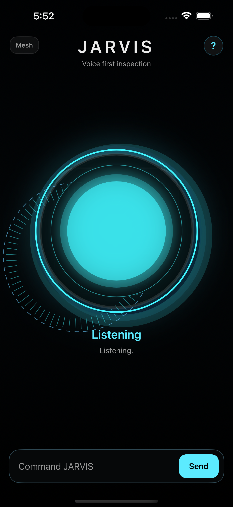
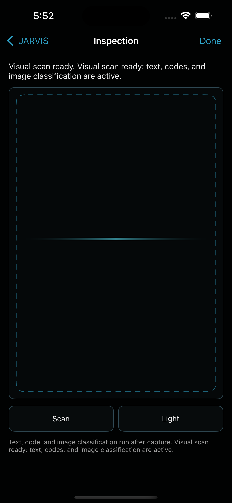
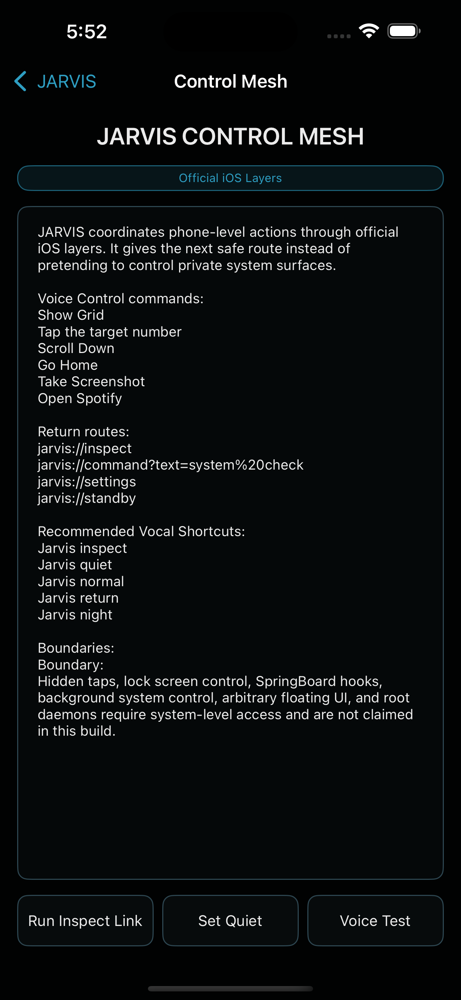
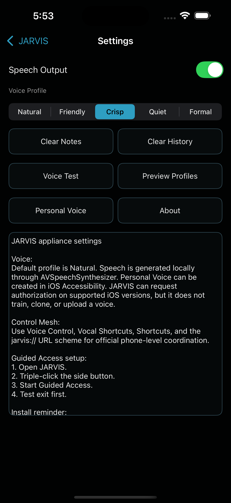

<div align="center">
  

  # JARVIS XR

  **A native, offline-first assistant interface for iPhone XR**

  Voice and typed commands, visual inspection, local memory, configurable speech,
  and public-API iOS automation guidance in one focused UIKit experience.

  [](ios/JarvisXR/project.yml)
  [](ios/JarvisXR/JarvisXR)
  [](https://github.com/Amrik-Majumdar/JarvisXR/actions/workflows/ios-build.yml)
  [](https://github.com/Amrik-Majumdar/JarvisXR/releases)
  [](LICENSE)

  [Download RC](https://github.com/Amrik-Majumdar/JarvisXR/releases) |
  [Install Guide](docs/INSTALLING_ON_IPHONE.md) |
  [Build From Source](docs/BUILDING.md) |
  [Documentation](docs/README.md)
</div>

> [!IMPORTANT]
> JARVIS XR is a native iOS prototype built exclusively with public APIs. It is not a jailbreak, firmware replacement, hidden system service, or unrestricted phone-control layer.

## Product Overview

JARVIS XR turns a dedicated iPhone into a focused assistant surface without relying on a browser UI or paid cloud APIs. The app centers interaction on a reactive orb, push-to-talk speech recognition, typed commands, local speech output, and camera-based visual inspection.

| Native interaction | Local intelligence | Device integration |
|---|---|---|
| Distinct standby, listening, processing, speaking, and inspection states | Local command routing, notes, history, and configurable responses | Camera, microphone, speech, Vision, App Intents, deep links, and Guided Access guidance |
| Voice-first interface with dependable typed fallback | OCR, barcode recognition, and built-in Vision image classification | Control Mesh routes supported actions through public iOS mechanisms |

## Interface

<table>
  <tr>
    <td align="center"><br><sub><b>Ready</b></sub></td>
    <td align="center"><br><sub><b>Listening</b></sub></td>
    <td align="center"><br><sub><b>Inspection</b></sub></td>
  </tr>
  <tr>
    <td align="center"><br><sub><b>Control Mesh</b></sub></td>
    <td align="center"><br><sub><b>Settings</b></sub></td>
    <td valign="middle"><b>Designed for iPhone XR</b><br><br>Portrait-first UIKit layout, full-screen dark interface, accessible labels, local settings, and a restrained visual system built around one central control surface.</td>
  </tr>
</table>

## Capabilities

| Area | Current implementation | Boundary |
|---|---|---|
| Voice input | In-app push-to-talk using Apple's Speech framework | Recognition availability and on-device processing vary by device, language, and Apple service state |
| Voice output | `AVSpeechSynthesizer` with persistent voice profiles | Installed system voices determine final sound |
| Visual inspection | AVFoundation capture, Vision OCR, QR/barcode recognition, and image classification | External object detection requires a compatible bundled Core ML model |
| Memory | Local notes, command history, search, and clear controls | Stored in the app container; removing the app can remove local data |
| Control Mesh | Deep links, App Intents, Shortcuts guidance, Voice Control phrases, and public app URL routes | No injected taps, hidden screen reading, global overlay, or private system hooks |
| Appliance use | Guided Access setup and dedicated-device workflow | iOS remains the operating system and security authority |

## Start Here

### Install the release candidate

1. Read the [iPhone installation guide](docs/INSTALLING_ON_IPHONE.md).
2. Download `JarvisXR-unsigned.ipa` from the [latest prerelease](https://github.com/Amrik-Majumdar/JarvisXR/releases).
3. Sign and sideload it with AltServer, Sideloadly, or another tool you trust.
4. Complete the [first-run checklist](docs/FIRST_RUN_CHECKLIST.md) before enabling Guided Access.

### Build it yourself

```bash
git clone https://github.com/Amrik-Majumdar/JarvisXR.git
cd JarvisXR/ios/JarvisXR
brew install xcodegen
xcodegen generate
xcodebuild -project JarvisXR.xcodeproj \
  -scheme JarvisXR \
  -sdk iphonesimulator \
  -destination 'platform=iOS Simulator,name=iPhone 16' \
  CODE_SIGNING_ALLOWED=NO test
```

Native builds require macOS and Xcode. Windows and Linux can run the Python validation suite, while the included GitHub Actions workflow performs the macOS build, simulator tests, visual proof capture, IPA audit, and unsigned IPA packaging.

See [Building](docs/BUILDING.md) for the complete reproducible path.

## Verification

Every app-affecting push runs the following gates:

```text
Registry validation -> Python tests -> XcodeGen -> iPhoneOS build
-> Swift unit tests -> simulator visual proof -> IPA audit -> artifacts
```

The workflow uploads:

- `JarvisXR-unsigned-ipa`
- `JarvisXR-ios-screenshot-proof`
- `JarvisXR-build-output`

The build is reproducible from source through a documented CI process. It is not claimed to be bit-for-bit deterministic across changing Xcode or macOS toolchains.

## Privacy and Safety

JARVIS XR has no developer-operated analytics, advertising, account, or cloud backend. Notes and command history remain in the app container. Camera analysis runs through Apple frameworks in the app. Speech recognition may be processed on-device or by Apple depending on device and language support.

Read the full [Privacy Policy](PRIVACY.md), [Terms](TERMS.md), [Security Policy](SECURITY.md), and [Disclaimer](DISCLAIMER.md) before installation.

## Public API Limits

Stock iOS does not permit this app to:

- replace SpringBoard or the lock screen
- install a root or launchd daemon
- read arbitrary content from other apps
- inject taps into other apps
- remap system buttons globally
- display arbitrary floating UI over other apps
- provide unrestricted background listening

JARVIS coordinates supported actions through public APIs and accessibility features. See [Features and Limits](docs/FEATURES_AND_LIMITS.md).

## Repository Map

```text
ios/JarvisXR/       Shipping Swift and UIKit app
core/               Tested command, registry, adapter, and device contracts
mock/               Mock phone state and CLI helpers required by router tests
native/             Preserved legacy native and jailbreak-era prototypes
preview/            Optional Windows interaction preview
tests/              Python validation entry point
tools/              Build, asset, IPA, and visual-proof utilities
assets/             Logo references and curated screenshots
docs/               Public build, install, architecture, and usage guides
.github/             CI workflow and contribution templates
```

The app under `ios/JarvisXR` is the current product. Files under `native/` are preserved prototypes and are not part of the shipping iOS target.

## Project Documents

| Build and install | Product and internals | Trust and support |
|---|---|---|
| [Building](docs/BUILDING.md) | [Architecture](docs/ARCHITECTURE.md) | [Privacy](PRIVACY.md) |
| [Install on iPhone](docs/INSTALLING_ON_IPHONE.md) | [Features and limits](docs/FEATURES_AND_LIMITS.md) | [Security](SECURITY.md) |
| [First run](docs/FIRST_RUN_CHECKLIST.md) | [Vision pipeline](docs/VISION.md) | [Support](SUPPORT.md) |
| [Troubleshooting](docs/TROUBLESHOOTING.md) | [Control Mesh](docs/CONTROL_MESH.md) | [Contributing](CONTRIBUTING.md) |

## License

Source code is available under the [MIT License](LICENSE). Apple, iPhone, iOS, Siri, Speech, Vision, Core ML, Xcode, and related marks belong to Apple Inc. JARVIS XR is an independent project and is not affiliated with or endorsed by Apple.
