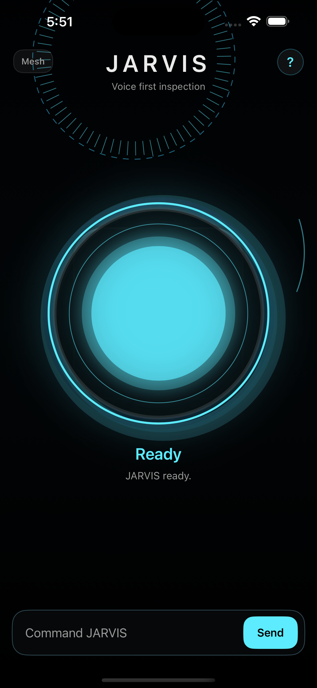

# JARVIS XR

A native iOS assistant prototype for iPhone XR combining voice commands, typed commands, visual scanning, Control Mesh actions, configurable speech output, and CI-based visual proof.

## Overview

JARVIS XR is a Swift and UIKit application designed as a focused assistant interface for a dedicated iPhone XR. It uses public iOS APIs and keeps its core command, speech, memory, and inspection workflows on the device.



## Features

- Voice-first interaction with distinct standby, listening, processing, and speaking states
- Reliable typed-command fallback
- Local speech output with selectable voice profiles
- Camera inspection with Apple Vision OCR and barcode recognition
- Built-in Vision fallback when no external object-detection model is bundled
- Local notes and command memory
- Control Mesh guidance for supported iOS accessibility and automation paths
- Native diagnostics and settings
- Guided Access compatible appliance-style operation

## Architecture

The production app is a native Swift and UIKit project under `ios/JarvisXR`. Supporting Python modules provide registry validation, daemon contracts, adapter prototypes, model generation, and Windows preview checks. The iOS app does not use a browser-based product shell.

The app uses public iOS frameworks including UIKit, AVFoundation, Speech, Vision, CoreMotion, CoreLocation, and App Intents where applicable.

## Reproducible Build

Native iOS builds require macOS and Xcode. The project uses XcodeGen to produce the Xcode project from `ios/JarvisXR/project.yml`.

```bash
brew install xcodegen
cd ios/JarvisXR
xcodegen generate
xcodebuild -project JarvisXR.xcodeproj -scheme JarvisXR -sdk iphoneos \
  -configuration Release CODE_SIGNING_ALLOWED=NO build
```

## Local Validation

Windows can run the Python validation gates:

```powershell
python core/registry/validate_registry.py
python native/ios/JarvisShell/scripts/generate_models.py
python tests/run_all_tests.py
python preview/windows_jarvis_preview/jarvis_preview.py --self-test
```

## GitHub Actions Pipeline

The iOS workflow generates the Xcode project, runs Swift unit tests and visual proof checks, audits the built application, packages an unsigned IPA, and uploads build artifacts. Review `.github/workflows/ios-build.yml` for the exact commands.

GitHub Actions produces unsigned IPA artifacts intended for sideload testing. It does not sign or publish an App Store build.

## iPhone Sideloading Note

An unsigned IPA must be signed during installation with an appropriate Apple ID and sideloading tool. Free Apple ID signing commonly requires periodic refresh. Test the app before enabling Guided Access.

## Limitations

JARVIS XR is not a jailbreak, firmware replacement, or private system service. Non-jailbroken iOS limits background control, arbitrary global overlays, private system hooks, and system-wide automation. Control Mesh coordinates supported public mechanisms such as app links, App Intents, Shortcuts, Voice Control guidance, and Guided Access. Real-device permissions and hardware behavior must be verified on the target phone.

Cloud AI and paid APIs are not required by the core application.

## Repository Structure

- `ios/JarvisXR`: Native Swift and UIKit application
- `core`: Command, registry, daemon, adapter, and device-profile prototypes
- `native`: Earlier native contracts and generated Objective-C model skeletons
- `preview`: Windows preview and self-test
- `tests`: Python validation suite
- `tools`: Asset and verification utilities
- `assets`: Visual references and selected product screenshots
- `.github/workflows`: Reproducible iOS CI pipeline

## License

This project is available under the MIT License. See [LICENSE](LICENSE).
